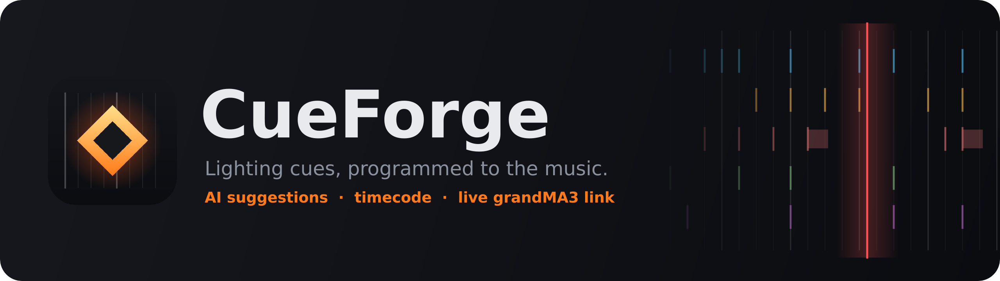
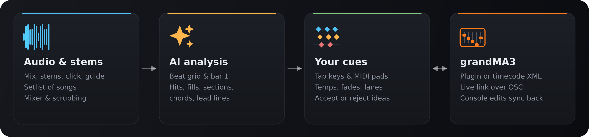

<p align="center">
  
</p>

<p align="center">
  <b>Plan every hit, strobe and look against the actual song, then send it straight to grandMA3.</b>
</p>

<p align="center">
  <a href="https://github.com/mitchellblaser/cueforge/actions/workflows/build.yml"></a>
  <a href="https://github.com/mitchellblaser/cueforge/releases/latest"></a>
  
  
  
  
</p>

<p align="center">
  <a href="docs/USER_GUIDE.md"><b>User Guide</b></a> ·
  <a href="docs/REFERENCE.md"><b>Feature reference</b></a> ·
  <a href="docs/ACCURACY.md"><b>Analysis accuracy</b></a> ·
  <a href="#-get-started"><b>Get started</b></a>
</p>

<br>

<p align="center">
  
</p>

CueForge is a desktop tool for lighting programmers. Load a song with its stems, click and
guide tracks, and program cues on a timeline that follows the music: tap them in live from
the keyboard or a MIDI pad controller, or let the analysis suggest hits, fills, section
changes and chord changes for you. Then send the whole setlist to **grandMA3**: as one plugin,
as timecode XML, or **live over the network** while you work.

<p align="center">
  
</p>

## ✨ Highlights

<table>
<tr>
<td width="50%" valign="top">

### 🎧 Built around the audio
- Mix, **stems**, click and guide tracks, each with its own fader, mute and solo
- A **beat grid** from the click track or the audio, which follows tempo drift in live recordings
- Scrub, loop, slow playback, and **cue blips** so you hear whether hits land
- **Live LTC out** while you play: striped (audio L, timecode R), any channel, or a second interface
- A **setlist** of songs in one project, each with its own start timecode

</td>
<td width="50%" valign="top">

### ✦ AI suggestions, never surprises
- **Accents** that break the groove: crashes, band stabs, stops (not every kick and snare)
- **Sections read from a spoken cue track** ("Verse… 3, 4"), on the downbeat after each call
- **Drum fills**, suggested as strobes held across the fill
- **Sections** and energy changes: verse, chorus, drop, build, blackout
- **Chord changes** as colour changes, **lead lines** as chase steps
- Suggestions stay ghosted until you **accept** them, and the analysis never touches your own cues

</td>
</tr>
<tr>
<td width="50%" valign="top">

### ⚡ Fast cue entry
- One **tap key** per lane: tap for a cue, **hold for a Temp** (strobes, blinders)
- **MIDI pads**, ready for the Midi Fighter Spectra and Launchpad / APC, with pads lit in lane colours
- **OSC control** from TouchOSC, Open Stage Control or a Stream Deck
- Fades and holds you can drag, **sections**, copy to repeats, **pattern fill**

</td>
<td width="50%" valign="top">

### 🎛️ grandMA3, both ways
- **One-step plugin** that builds every song's sequences, cues and timecode show
- **Timecode XML** and command lists, plus **LTC** audio and CSV
- **Live link over OSC**: cues fire as you play, and sequences and timecode are created as you program
- **Console edits come back**, from moved events to cues added on the desk

</td>
</tr>
</table>

## 🎚️ How a show comes together

1. **Add your songs.** Drop a folder per song; the mix, stems and click are recognised by name.
2. **Analyse.** Get a beat grid, set bar 1 with one key, and review the suggestions with
   `Tab`, `A` and `X`.
3. **Program.** Tap cues in time with the song, hold keys for Temps, or play them on MIDI pads.
4. **Send it to the desk.** Turn on the live link (`Ctrl+L`), or export the plugin for the whole
   setlist. Each song gets its own sequences and a timecode show starting at 0, with its
   start time set as MA's **Offset TC Slot**, so a song can be nudged on site.

> **Lanes become sequences.** A lane is either *per song* (each song gets "*Song Lane*", e.g.
> "Opener Main Cues") or *shared* across the setlist (e.g. Hits, Strobe). Sequences are created
> together from a **Sequence start** number and then found by name, so you can move them around
> on the console.

## 🚀 Get started

The quickest way is a [**ready-made build from Releases**](https://github.com/mitchellblaser/cueforge/releases/latest).
To run from source you need **Python 3.10–3.12** ([python.org](https://www.python.org/downloads/)).

| | |
|---|---|
| **Windows** | double-click `run_cueforge.bat` |
| **macOS** | double-click `run_cueforge.command` (the first time: right-click › Open) |

The first run sets up a `.venv` and installs everything, which takes a few minutes. Or do it by hand:

```bash
python -m venv .venv
source .venv/bin/activate        # Windows: .venv\Scripts\activate
pip install -r requirements.txt
python -m cueforge
```

**Ready-made app:** download the Windows or macOS zip from
[**Releases**](https://github.com/mitchellblaser/cueforge/releases/latest). On macOS, open it the
first time with right-click › Open (the app isn't signed).

**Build it yourself:** `packaging\build_windows.bat` (Windows) or `bash packaging/build_macos.sh` (macOS).

**Optional AI models:** CueForge offers to install [Beat This!](https://github.com/CPJKU/beat_this)
and [Demucs](https://github.com/facebookresearch/demucs) (about 600 MB, once) for stronger beat
tracking and stem separation. The built-in analysis works without them.

### Connecting to grandMA3

In *Menu › In & Out › OSC* on the console or onPC, add:

| Line | Direction | Settings |
|---|---|---|
| 1 | CueForge → console | Port **8000**, UDP, **Receive** + **Receive Command**, empty prefix |
| 2 | console → CueForge | Port **8001**, **Send** + **Send Command** (for console edits coming back) |

Then open **File › grandMA3 live link…** (`Ctrl+L`) in CueForge and press *Send test*. The
[User Guide](docs/USER_GUIDE.md) walks through it step by step.

## ⌨️ A few shortcuts

| Key | | Key | |
|---|---|---|---|
| `Space` | Play / pause | `1`–`9` | Tap a cue (hold for a Temp) |
| `Q` / `W` | ＋ Cue / ＋ Temp | `H` | Hold / fade for the selection |
| `Tab` | Next suggestion | `A` / `X` | Accept / reject |
| `D` | Bar 1 here | `M` | Add a section |
| `Ctrl+P` | Pattern fill | `Ctrl+L` | grandMA3 live link |

All of them are in the app under `F1` and in the [feature reference](docs/REFERENCE.md#keyboard-shortcuts-f1-in-the-app).

## 📚 Documentation

- **[User Guide](docs/USER_GUIDE.md)**: a step-by-step manual for programming a show.
- **[Feature reference](docs/REFERENCE.md)**: every feature, export option and live-link detail.
- **[Analysis accuracy](docs/ACCURACY.md)**: how the suggestions score on a multi-genre test set.

## 🛠️ Development

```bash
pip install -r requirements-dev.txt
QT_QPA_PLATFORM=offscreen python -m pytest -q
```

**Releasing:** push a version tag (`git tag v1.0.1 && git push origin v1.0.1`), or run the *Build*
workflow from the Actions tab with a version filled in. Windows and macOS are built and tested, and
the zips are attached to a new release. A tag with a dash (`v1.1.0-beta1`) makes a pre-release.

```
cueforge/
  core/       model, timecode, editing, grid tools, undo, project files
  audio/      decoding, real-time multitrack engine (mixer, click, blips, varispeed, loop)
  analysis/   beat grid, hits, fills, sections, energy, chords, lead lines, Demucs
  control/    MIDI, OSC, grandMA3 live link and console pull
  export/     grandMA3 (plugin, XML, commands), CSV, LTC
  ui/         Qt main window, timeline, mixer, panels, dialogs
packaging/    PyInstaller spec, build scripts, icon and README art
```

The README graphics are drawn by `python packaging/make_readme_art.py`.

> **Before a show:** test the import in grandMA3 onPC first. MA doesn't publish its timecode
> XML schema; CueForge follows the layout grandMA3 itself exports (v1.4–2.x).
