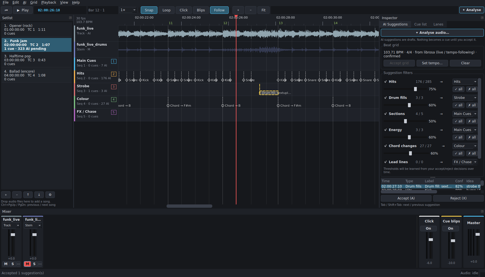

# CueForge

A desktop tool for lighting programmers. Import a song (and its stems, click and guide
tracks), plan hits and cue changes against timecode, and export the result to
**grandMA3**.

CueForge can also **analyse the audio and suggest** cues:
- **Hits** on kick, snare and crash.
- **Drum fills**: fast 16th, sextuplet or 32nd runs on snare and toms going into a new bar,
  suggested as strobes held across the fill. Kick/snare hits inside the fill are then hidden.
- **Section changes**: verse, chorus, drop, breakdown, build and blackout.
- **Chord changes**, suggested as colour changes.
- **Lead lines**: synth, guitar or vocal phrases, which you can accept as chase steps (one
  cue per note).
- The **beat grid**, which follows tempo drift in live recordings.

These are only suggestions. They show as ghosted markers until you accept them, and the
analysis never creates, moves or deletes a confirmed cue. Accuracy on a six-song
multi-genre test set (live and studio styles) is documented in
[docs/ACCURACY.md](docs/ACCURACY.md).



---

## Install and run

### Run from source (Windows / macOS)

You need Python 3.10–3.12 ([python.org](https://www.python.org/downloads/)).

- **Windows:** double-click `run_cueforge.bat`
- **macOS:** double-click `run_cueforge.command` (first time: right-click › Open)

The first run creates a `.venv` folder and installs the dependencies, which takes a few
minutes. Or do it by hand:

```bash
python -m venv .venv
.venv\Scripts\activate          # Windows
source .venv/bin/activate        # macOS
pip install -r requirements.txt
python -m cueforge               # optionally: python -m cueforge song.wav click.wav
```

### Build a standalone app

- **Windows:** `packaging\build_windows.bat` → `dist\CueForge\CueForge.exe`
- **macOS:** `bash packaging/build_macos.sh` → `dist/CueForge.app`
- **GitHub:** push the repo and run the *Build* workflow (Actions tab, or push a `v*` tag).
  It produces zipped Windows and macOS builds as downloadable artifacts.

Each build runs the test suite and then `CueForge --self-test` inside the packaged app.
The macOS app isn't code-signed, so open it the first time with right-click › Open.

### Optional: deep-learning models

The built-in analysis (librosa) needs no extra downloads. For stronger beat tracking and
stem separation:

```bash
pip install -r requirements-ai.txt     # PyTorch, Demucs, Beat This!
```

- **Beat This!** is used automatically for beat and downbeat tracking when installed. Its
  weights download on first use.
- **Demucs** separates the mix into drums, vocals and other stems, so hits can be detected
  per stem. Enable it in the *Analyse* dialog. It's slow on CPU, and results are cached
  next to the project.
- **All-In-One** (`pip install allin1`, optional) labels sections (verse, chorus, …) when
  installed.

If a model fails to load (for example, no internet on first use), CueForge falls back to
the built-in analysis.

---

## Setlist (multiple songs per project)

The **Setlist** sidebar on the left lists the songs in the project. Click a song to open it
on the timeline.
- Each song has its own audio tracks, mixer, cues, AI suggestions, beat grid and **start
  timecode**.
- **Lanes** (MA3 sequences) are shared by the whole show.
- **＋** or dropping audio files on the list adds a song. Drag to reorder.
  **Ctrl+PgUp / PgDn** goes to the previous / next song.
- **⚙ / double-click → Song settings**: name, start timecode, grandMA3 *Timecode slot*, first
  cue number, and an optional sequence offset (if each song uses its own block of sequences).
- New songs default to the next hour (song 2 at 02:00:00:00…), the next Timecode slot and
  their own cue range (1, 101, 201…). *Right-click › Auto-number setlist* resets all songs to
  that scheme.
- **Export › grandMA3** can export the current song or the **whole setlist**:
  - XML: one timecode file per song.
  - Lua: a single plugin that builds every song's timecode show.
  - Command list: all songs.
  The export dialog warns if two songs would write the same cue number into the same sequence.
- **CSV** export can include the whole setlist, with a Song column.
- Analysis runs on the current song. If you switch songs while it runs, the results still go
  to the song that was analysed.
- Undo jumps back to the song where the change happened.

## Workflow

1. **Import audio.** Use *File › Import audio* or drag files onto the window. Each file
   gets a mixer strip and a **role**, guessed from its filename:
   | Role | Used for |
   |---|---|
   | **Track** | the main mix; analysed |
   | **Stem** | drums, vocals, etc.; analysed per stem (a drum stem gives kick/snare hits) |
   | **Click** | builds the beat grid directly, sample-accurate |
   | **Cue/Guide** | spoken cues and count-ins; played, never analysed |
   | **Other** | played, never analysed |

   Set a per-track **offset** (⋯ button on the strip) if files don't start together.

2. **Mix.** Each strip has a fader (double-click resets to 0 dB), meter, **M**ute and
   **S**olo. There is also a generated **Click** (from the beat grid, with an accent on bar 1),
   **Cue blips** (a tick on every confirmed cue, so you can hear whether hits land) and **Master**.

3. **Analyse** (✦ Analyse, Ctrl+R). Suggestions appear in the lanes as dashed, ghosted
   markers, more opaque when confidence is higher. Each one comes with an **idea** for
   what to program there:
   | Type | Lane (default) | What it finds | Idea |
   |---|---|---|---|
   | ◇ Hits | Hits | kick, snare and crash (not hats, ride or ghost notes) | bump / flash / blinder |
   | ⚡ Drum fills | Strobe | fast runs (16ths / sextuplets / 32nd rolls) on snare and toms into the next bar; the hits inside are folded into the fill | strobe from the first fast note, Off on the landing |
   | □ Sections | Main Cues | verse / chorus / bridge changes, moved onto the downbeat a fill lands on | new look |
   | △ Energy | Main Cues | drops, breakdowns, builds, blackouts, returns | |
   | ○ Chord changes | Colour | harmony changes, e.g. "Chord → F#m" | colour change |
   | ♪ Lead lines | FX / Chase | vocal, synth, guitar or horn phrases, rising / falling / fast runs | follow-spot, tilt with the line, chase steps |

   - The beat grid is shown dashed and orange until you click *Accept grid*.
   - Lanes for new suggestion types are created automatically.
   - **Lead lines are accurate from stems.** Import vocal / lead / synth stems with role
     **Stem**, or tick *Demucs*. CueForge checks whether each stem plays a single line or
     chords, and uses chord parts for chord changes only. From a full mix, lead lines are a
     rough estimate (opt-in, hidden by default).

4. **Live recordings**
   - The beat tracker follows tempo drift and loose timing beat by beat. Steady studio
     material snaps to a perfectly even grid.
   - The meter (3/4 or 4/4) is detected automatically.
   - **Grid › Tap-along grid**: tap **T** on every beat while the song plays. Taps snap to
     the actual kick/snare hits and missed taps are filled in; turn tap mode off to build
     the grid. Use it for rubato passages, or to fix a section the tracker got wrong. It
     only replaces the part you tapped.
   - **Grid › Halve / Double tempo** fixes a grid locked onto 8th or half notes.
   - Tap *cues* live with the lane keys as usual. Taps compensate for audio output latency.

5. **Review**
   - **Tab / Shift+Tab** jumps between suggestions; **A** accepts, **X** rejects. Either one
     moves on to the next suggestion.
   - **P** plays from 2 s before the selected suggestion or cue.
   - The *AI Suggestions* tab has a **confidence threshold** per type, the target lane per
     type, and **Accept all** / **Reject all**.
   - Accepted and rejected decisions persist. Re-analysing never brings back something you
     rejected and never duplicates a cue.
   - Over time CueForge learns thresholds from your decisions (*Apply learned
     thresholds*). It only offers them; it never applies them by itself.

6. **Program manually (fast)**
   - The **active lane** is highlighted with ▶. Click a lane header (or empty space in a lane),
     use **↑ / ↓**, or pick it in the toolbar's *Active lane* box.
   - **＋ Cue (Q)** drops a normal cue at the playhead in the active lane.
   - **＋ Temp (W)** drops a **Temp**: a cue with a hold time. Set the hold in the **Hold**
     box (default 0.5 s, or *= 1 beat*).
   - Both work while playing (at the heard position, latency-compensated) or stopped, and
     snap to the grid when Snap is on.
   - Selecting a Temp shows its hold in the Hold box; change it there to edit it.
     **Shift+W / Shift+Q** turn selected cues into Temps / normal cues.
   - Press a lane's **tap key** (1, 2, 3, …) during playback to drop a cue at the playhead.
   - Double-click a lane to add a cue. Drag cues to move them (they snap to beats when
     **Snap** is on; hold Alt to stop snapping), or drag them into another lane.
   - **←/→** nudges by a frame, **Shift+←/→** by a beat. **G** snaps to the grid.
   - Double-click a cue to edit its label, MA3 cue number, fade, notes and exact timecode.
   - Loop a region with **Shift-drag in the ruler**, or with **I / O**, then **L**. Slow
     playback with **[** (0.75×, 0.5×).

7. **Export** (*File › Export*)
   - **grandMA3**: each lane becomes a timecode track targeting the lane's **MA3
     sequence**. Normal cues become *Goto* events. **Temps** (cues with a hold time, e.g.
     from ＋ Temp or an accepted drum-fill strobe) become **Temp On** at the cue and
     **Temp Off** when the hold ends. Cue numbers you
     leave blank are filled in automatically. Three formats:
     - **Timecode XML**: import into the Timecode pool.
     - **Lua plugin**: creates any missing (empty, labelled) cues and builds the timecode
       show on the console. It also writes the `.xml` descriptor MA3 needs to import a plugin.
     - **Command list**: `Store`/`Label` lines that create the cues.
   - **CSV** cue list, for paperwork.
   - **LTC WAV**: SMPTE timecode audio, optionally stereo with the song mix on L and LTC on R.
     Set *Project settings › Song starts at timecode* (e.g. `01:00:00:00`) to leave room for
     pre-roll.

   Only confirmed cues are exported. Pending suggestions never are.

> **grandMA3 note:** MA doesn't publish the timecode XML schema. CueForge's XML follows
> the layout grandMA3 itself exports (v1.9–2.x). Times are stored in MA's internal units
> (1/16 777 216 s), and *Seconds* is also offered. **Test the import in grandMA3 onPC
> before a show.** If your version rejects it, use the **Lua plugin** export, which builds
> the show through the console's own object API.

---

## Keyboard shortcuts (F1 in the app)

| Key | Action |
|---|---|
| Space | Play / pause |
| Home / Enter, End | Go to start / end |
| 1 … 9 | Tap a cue into that lane (configurable per lane) |
| ← / → | Nudge selection 1 frame (no selection: playhead 1 beat) |
| Shift + ← / → | Nudge selection 1 beat (no selection: playhead 1 bar) |
| Tab / Shift+Tab | Next / previous suggestion |
| Q / W | ＋ Cue / ＋ Temp in the active lane at the playhead |
| ↑ / ↓ | Previous / next active lane |
| Shift+W / Shift+Q | Make selected cues Temps / normal cues |
| A / X | Accept / reject selected suggestions |
| Right-click lead line | Accept as chase steps (one cue per note) |
| T | Tap a grid beat (in *Grid › Tap-along grid* mode) |
| P | Preview: play from 2 s before the selection |
| Delete | Delete selection |
| S / G | Snap on/off / snap selection to grid |
| I / O / L | Loop in / out / on-off |
| [ / ] | Playback speed |
| C / B | Click / cue blips on-off |
| F / Z | Follow playhead / zoom to fit |
| Ctrl + wheel, + / − | Zoom |
| Ctrl+PgUp / Ctrl+PgDn | Previous / next song in the setlist |
| Ctrl+Shift+N | Add a song |
| Ctrl+Z / Ctrl+Shift+Z | Undo / redo |

---

## Project files

`.cueproj` is JSON. Audio paths are stored relative to the project file, so you can move a
folder containing both. Missing audio can be relinked from the mixer strip's ⋯ menu.
Projects with unsaved changes are autosaved every two minutes to `<project>.cueproj.autosave`.

## Development

```bash
pip install -r requirements-dev.txt
QT_QPA_PLATFORM=offscreen python -m pytest -q
```

The accuracy tests need FluidSynth and a GM soundfont to render the multi-genre corpus;
they're skipped automatically when those aren't installed, or with `CUEFORGE_SKIP_SLOW=1`:

```bash
sudo apt install fluidsynth fluid-soundfont-gm      # macOS: brew install fluid-synth (+ a GM .sf2)
pip install pretty_midi pyfluidsynth mir_eval
python -m tests.evaluate            # accuracy table, full mix
python -m tests.evaluate --stems    # with stems
```

```
cueforge/
  core/       model, timecode (incl. 29.97 DF), editing ops, grid tools (tap-along, halve/double), undo, project I/O
  audio/      decoding/resampling/peaks, real-time multitrack engine (mixer, click, blips, varispeed, loop)
  analysis/   beat grid (click track, Beat This!, tempo-following DP tracker, meter), hits, drum fills,
              sections, energy, chord changes, lead lines, Demucs, threshold learning
  export/     grandMA3 (XML, Lua, commands), CSV, LTC encoder/decoder
  ui/         Qt main window, timeline, mixer, panels, dialogs
tests/        unit, UI, optional backends, multi-genre corpus (corpus.py) + accuracy evaluation (evaluate.py)
packaging/    PyInstaller spec, build scripts, icon
```
