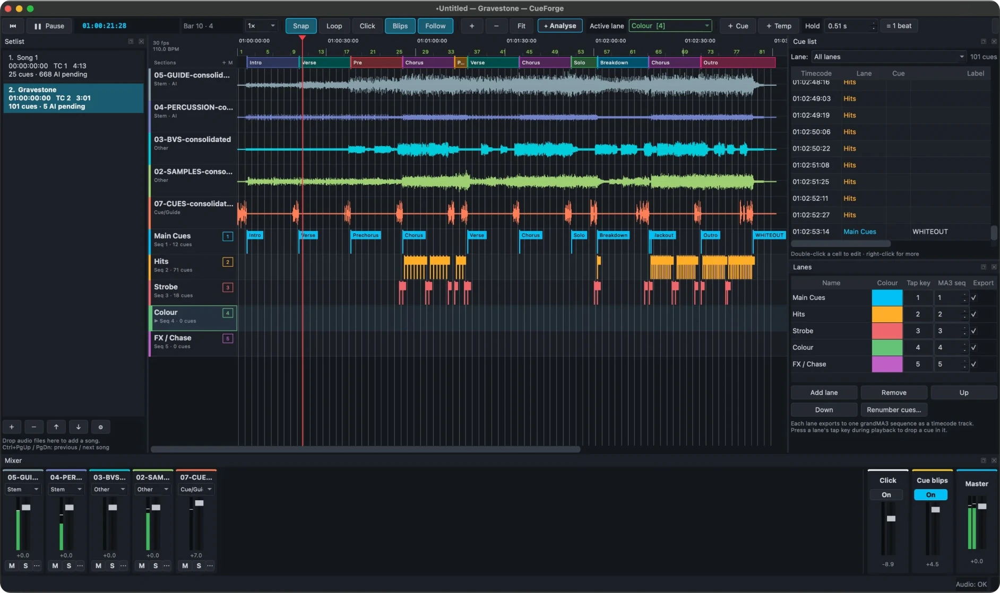

# CueForge reference

Everything CueForge does, feature by feature. For a step-by-step introduction see the
[User Guide](USER_GUIDE.md); for the overview see the [README](../README.md).


A desktop tool for lighting programmers. Import a song (and its stems, click and guide
tracks), plan hits and cue changes against timecode, and export the result to
**grandMA3**: as a one-step plugin, timecode XML, or **live** over the network. The live
link creates and fires cues as you program, pushes each song's timecode show, and brings
edits made on the console back.

CueForge can also **analyse the audio and suggest** cues:
- **Hits** on kick, snare and crash.
- **Drum fills**: fast 16th, sextuplet or 32nd runs on snare and toms going into a new bar,
  suggested as strobes held across the fill. Kick/snare hits inside the fill are then hidden.
- **Section changes**: verse, chorus, drop, breakdown, build and blackout.
- **Chord changes**, suggested as colour changes.
- **Lead lines**: synth, guitar or vocal phrases, which you can accept as chase steps (one
  cue per note).
- The **beat grid**, which follows tempo drift in live recordings.

These are only suggestions. They show as ghosted markers until you accept them, and the
analysis never creates, moves or deletes a confirmed cue. Accuracy on a six-song
multi-genre test set (live and studio styles) is documented in
[docs/ACCURACY.md](ACCURACY.md).

**New to CueForge?** Read the [User Guide](USER_GUIDE.md), a step-by-step manual for
programming a show.



---

## Install and run

### Run from source (Windows / macOS)

You need Python 3.10–3.12 ([python.org](https://www.python.org/downloads/)).

- **Windows:** double-click `run_cueforge.bat`
- **macOS:** double-click `run_cueforge.command` (first time: right-click › Open)

The first run creates a `.venv` folder and installs the dependencies, which takes a few
minutes. Or do it by hand:

```bash
python -m venv .venv
.venv\Scripts\activate          # Windows
source .venv/bin/activate        # macOS
pip install -r requirements.txt
python -m cueforge               # optionally: python -m cueforge song.wav click.wav
```

### Build a standalone app

- **Windows:** `packaging\build_windows.bat` → `dist\CueForge\CueForge.exe`
- **macOS:** `bash packaging/build_macos.sh` → `dist/CueForge.app`
- **GitHub:** push a `v*` tag (e.g. `v1.0.1`), or run the *Build* workflow from the Actions
  tab with a version filled in. It builds and tests Windows and macOS and attaches the zips
  to a new release on the Releases page (a tag with a dash, e.g. `v1.1.0-beta1`, makes a
  pre-release). Run it without a version to get the zips as workflow artifacts only.

Each build runs the test suite and then `CueForge --self-test` inside the packaged app.
The macOS app isn't code-signed, so open it the first time with right-click › Open.

### Optional: advanced AI models

The built-in analysis (librosa) needs no extra downloads. For stronger beat tracking and
stem separation, CueForge can install two deep-learning models itself. No command line is
needed:

- On first start CueForge offers to install them. You can also use **AI › AI models…** at any
  time, or the *Install AI models…* button in the Analyse dialog. It downloads about 600 MB
  once: PyTorch plus the models. There's an option for the NVIDIA GPU build on Windows.
  - The packaged app installs into its own folder (`%LOCALAPPDATA%\CueForge` or
    `~/Library/Application Support/CueForge`), using only ready-made packages.
  - From source, they go into CueForge's own Python environment.
- **Beat This!** is then used automatically for beats and downbeats.
- **Demucs** separates the mix into drums / bass / vocals / other, so hits and fills are
  found per stem. Tick it in the *Analyse* dialog. It's slow on CPU, and results are cached
  next to the project.
- *Remove AI models* in the same dialog deletes the packages and the downloaded weights.
- From the command line instead: `pip install -r requirements-ai.txt`. **All-In-One**
  (`pip install allin1`, optional) labels sections when installed.

If a model fails to load, CueForge falls back to the built-in analysis.

---

## Setlist (multiple songs per project)

The **Setlist** sidebar on the left lists the songs in the project. Click a song to open it
on the timeline.
- Each song has its own audio tracks, mixer, cues, AI suggestions, beat grid and **start
  timecode**.
- **Lanes** are shared by the whole show. Each lane is either **Per song** (every song gets
  its own grandMA3 sequence, named "*Song Lane*", e.g. "Opener Main Cues") or **shared** (one
  sequence for the whole setlist, named after the lane, e.g. Hits, Strobe).
- **＋** or dropping audio files on the list adds a song. Drag to reorder.
  **Ctrl+PgUp / PgDn** goes to the previous / next song.
- **Bulk import.** *File › Add songs from a folder* makes one song per sub-folder; the mix,
  stems and click inside are recognised from their names, including sub-folders such as
  `Stems/`. Loose audio files become a song each. *Add songs from files* makes one song per
  file. Afterwards CueForge offers to analyse them all.
- **⚙ / double-click → Song settings**: name, start timecode, grandMA3 *Timecode slot* and
  the first cue number in shared lanes. The dialog lists the sequence each lane uses.
- New songs default to the next hour (song 2 at 02:00:00:00…), the next Timecode slot and
  their own cue range in shared lanes (1, 101, 201…). Per-song lanes always start at cue 1.
  *Right-click › Auto-number setlist* resets all songs to that scheme.
- **Export › grandMA3** can export the current song or the **whole setlist**:
  - XML: one timecode file per song.
  - Lua: a single plugin that builds every song's timecode show.
  - Command list: all songs.
  The export dialog warns if two songs would write the same cue number into the same sequence
  (a shared lane, or two songs with the same name).
- **CSV** export can include the whole setlist, with a Song column.
- **Analyse all songs** (*AI › Analyse all songs…*, Ctrl+Shift+R, or the *Analyse:* choice in
  the Analyse dialog: this song, all songs, or songs not analysed yet). Songs are analysed
  one after another, and each song's suggestions land in that song.
- Analysis runs in a separate background process, so the app stays responsive however heavy
  the AI models are. Keep programming, switch songs, or leave it running; *Cancel* stops it.
  The progress bar moves steadily and shows the time left. It learns how fast this computer
  is, so the estimate improves after the first run.
- Undo jumps back to the song where the change happened.

## Workflow

1. **Import audio.** Use *File › Import audio* or drag files onto the window. Each file
   gets a mixer strip and a **role**, guessed from its filename:
   | Role | Used for |
   |---|---|
   | **Track** | the main mix; analysed |
   | **Stem** | drums, vocals, etc.; analysed per stem (a drum stem gives kick/snare hits) |
   | **Click** | builds the beat grid directly, sample-accurate |
   | **Cue/Guide** | spoken cues and count-ins; played, never analysed |
   | **Other** | played, never analysed |

   Set a per-track **offset** (⋯ button on the strip) if files don't start together.

2. **Mix.** Each strip has a fader (double-click resets to 0 dB), meter, **M**ute and
   **S**olo. There is also a generated **Click** (from the beat grid, with an accent on bar 1),
   **Cue blips** (a tick on every confirmed cue, so you can hear whether hits land) and **Master**.
   Cues in several lanes at the same moment give one blip, not a louder stack, and the Click
   and Cue blips strips have meters too.

3. **Analyse** (✦ Analyse, Ctrl+R). Suggestions appear in the lanes as dashed, ghosted
   markers, more opaque when confidence is higher. Each one comes with an **idea** for
   what to program there:
   | Type | Lane (default) | What it finds | Idea |
   |---|---|---|---|
   | ◇ Hits | Hits | kick, snare and crash (not hats, ride or ghost notes) | bump / flash / blinder |
   | ⚡ Drum fills | Strobe | fast runs (16ths / sextuplets / 32nd rolls) on snare and toms into the next bar; the hits inside are folded into the fill | strobe from the first fast note, Off on the landing |
   | □ Sections | Main Cues | verse / chorus / bridge changes, moved onto the downbeat a fill lands on | new look |
   | △ Energy | Main Cues | drops, breakdowns, builds, blackouts, returns | |
   | ○ Chord changes | Colour | harmony changes, e.g. "Chord → F#m" | colour change |
   | ♪ Lead lines | FX / Chase | vocal, synth, guitar or horn phrases, rising / falling / fast runs | follow-spot, tilt with the line, chase steps |

   - The beat grid is shown dashed and orange until you click *Accept grid*.
   - Lanes for new suggestion types are created automatically.
   - **Lead lines are accurate from stems.** Import vocal / lead / synth stems with role
     **Stem**, or tick *Demucs*. CueForge checks whether each stem plays a single line or
     chords, and uses chord parts for chord changes only. From a full mix, lead lines are a
     rough estimate (opt-in, hidden by default).

4. **Live recordings**
   - The beat tracker follows tempo drift and loose timing beat by beat. Steady studio
     material snaps to a perfectly even grid.
   - The meter (3/4 or 4/4) is detected automatically.
   - **Grid › Tap-along grid**: tap **T** on every beat while the song plays. Taps snap to
     the actual kick/snare hits and missed taps are filled in; turn tap mode off to build
     the grid. Use it for rubato passages, or to fix a section the tracker got wrong. It
     only replaces the part you tapped.
   - **Grid › Halve / Double tempo** fixes a grid locked onto 8th or half notes.
   - **Bar 1.** If a song starts with a gap, the tracker no longer fills the silence with
     beats, so bar 1 is the band's first bar.
     - If bar 1 is still wrong, press **D** on the "one" while the song plays (or with the
       playhead on it). You can also use *Grid › Move bar 1 one beat earlier / later*
       (**Ctrl+Alt+← / →**), or right-click a beat › *Make the nearest beat bar 1*.
     - Bars before it are numbered 0, −1… (count-in). *Remove beats before bar 1* deletes them.
     - Setting bar 1 confirms the grid. A **↻ Re-analyse with the new bars** button appears,
       so sections, fills and chord changes line up with your bars. Re-analysis always keeps
       a confirmed grid.
   - **Pauses.** When the band stops mid-song and comes back in, the bar count is checked
     again after the pause:
     - A stop of a whole number of beats keeps counting.
     - After a free-time pause, the music after it decides where bar 1 is (usually the band
       comes back on the one).
   - Tap *cues* live with the lane keys as usual. Taps compensate for audio output latency.

5. **Review**
   - **Tab / Shift+Tab** jumps between suggestions; **A** accepts, **X** rejects. Either one
     moves on to the next suggestion. Untick *Jump to the next suggestion after Accept /
     Reject* (AI Suggestions tab, or the AI menu) to stay where you are.
   - **P** plays from 2 s before the selected suggestion or cue.
   - The *AI Suggestions* tab has a **confidence threshold** per type, the target lane per
     type, and **Accept all** / **Reject all**.
   - The *Show suggestions* filters only **hide** suggestions. The setlist's "AI to review"
     count follows the filters. To get rid of hidden ones for good, press **Reject hidden**.
   - Accepted and rejected decisions persist. Re-analysing never brings back something you
     rejected and never duplicates a cue.
   - Over time CueForge learns thresholds from your decisions (*Apply learned
     thresholds*). It only offers them; it never applies them by itself.

6. **Program manually (fast)**
   - **Scrub**: drag in the ruler or a waveform while stopped to hear the audio under the
     playhead. Speed and direction follow your drag (*View › Scrub audio* turns it off).
   - **Reorder lanes** by dragging a lane header on the timeline, or the ≡ handle in the
     *Lanes* panel. Keys 1–9 follow the new order: the top lane is key 1.
   - The **active lane** is highlighted with ▶. Click a lane header (or empty space in a lane),
     use **↑ / ↓**, or pick it in the toolbar's *Active lane* box.
   - **＋ Cue (Q)** drops a normal cue at the playhead in the active lane.
   - **＋ Temp (W)** drops a **Temp**: a cue with a hold time. Set the hold in the **Hold**
     box (default 0.5 s, or *= 1 beat*).
   - Both work while playing (at the heard position, latency-compensated) or stopped, and
     snap to the grid when Snap is on.
   - Selecting a Temp shows its hold in the Hold box; change it there to edit it. With several
     Temps selected, the Hold box changes them all. You can also **drag the end of a Temp's
     hold bar** on the timeline, or the **top end of a fade ramp** to change the fade; both snap
     to the grid, Alt gives free movement, and with several cues selected they all change.
   - **Hold / fade for many cues (H):** select any number of cues (drag a box, or
     Ctrl/Shift-click), press **H** (or right-click), and give them all a hold, turning Go
     cues into Temps, or remove the hold to make them Go cues again. You can also set or clear
     their fade. It's one undo step. Cues with a fade show a rising ramp, as long as the fade, after
     them on the timeline. **Shift+W / Shift+Q** quickly turn the selection into
     Temps / normal cues.
   - Press a lane's **tap key** (1, 2, 3, …) during playback to drop a cue at the playhead.
     **Press and hold** it to drop a **Temp** for as long as you hold the key, e.g. hold 3 for
     a strobe. The Temp grows on the timeline while you hold. With Snap on, its start and end
     snap to the grid. Every key holds on its own, so you can keep 3 down and tap 2 meanwhile.
   - **Temp lengths, everywhere** (held keys, MIDI Temp pads, ＋Temp / W):
     - A quick hit gets exactly the length in the **Hold** box, so quick strobes come out even.
       With Snap on, a Hold that ends just off a grid line (e.g. 0.98 s against a 1.00 s beat)
       lands on it.
     - Longer holds keep their own length; with Snap on the end lands on the grid, at least
       one grid step after the start.
     - How long you held is measured from the moment you pressed, even when the start snapped
       back to the previous beat.
   - Taps are timed from the moment the key went down (from the key event's own timestamp),
     so a busy screen never makes them land late. Snapping always goes to the nearest grid
     point.
   - **Snap resolution** (next to *Snap* in the toolbar) is 1 beat, ½ or ¼ beat. It applies to
     new cues, drags, Temp ends and held Temps.
   - Double-click a lane to add a cue. Drag cues to move them (they snap to beats when
     **Snap** is on; hold Alt to stop snapping), or drag them into another lane.
   - **←/→** nudges by a frame, **Shift+←/→** by a beat. **G** snaps to the grid.
   - Double-click a cue to edit its label, MA3 cue number, fade, notes and exact timecode.
   - Loop a region with **Shift-drag in the ruler**, or with **I / O**, then **L**. Slow
     playback with **[** (0.75×, 0.5×).

7. **Sections, copy & paste, patterns** (*Arrange* menu)
   - The **section band** under the ruler holds your song sections. Add a marker with
     **M** (or click *＋ M*). Double-click to rename. *Create sections from AI suggestions*
     turns the analysis into markers you can then fix.
     - **Resize:** drag a section's start or end edge. A boundary shared with the next
       section moves for both.
     - **Move:** drag the middle of a section to move it, keeping its length; its neighbours
       grow or shrink.
     - Sections snap to bar lines when Snap is on (Alt = free), and every change can be undone.
   - Sections with the same name (*Chorus 1*, *Chorus 2*) are repeats. Right-click a section
     › **Copy cues to all repeats**, or to any one section. Cues are placed by beats from the
     section start, so they land correctly even if a live band drifted, and they're cut at
     the end of a shorter section.
   - **Ctrl+C / Ctrl+V** pastes at the playhead. **Ctrl+Shift+V** pastes into the section
     under the playhead, keeping the cues' position inside their section.
   - **Pattern fill (Ctrl+P)**: a cue or Temp every bar, 2 beats, beat, 8th, triplet or 16th
     over the loop region, a section or the selection. Options for offset (e.g. off-beats),
     labels ("Chase {n}") and replacing existing cues.

8. **MIDI & OSC control** (*File › MIDI & OSC control…*)
   - **MIDI**: pick the input and output ports. By default the bottom row of 8 pads (notes
     36–43) drops cues into lanes 1–8, and the next row (44–51) drops Temps, on any MIDI
     channel. That works out of the box with a **Midi Fighter Spectra** (bank 1, channel 3) and
     with Launchpad / APC-style pad controllers. Ports are found again if the OS renumbers them. Remap anything
     with **Learn**. Other actions you can map: play/stop, next/previous lane, song or
     suggestion, accept/reject, undo, add section, loop.
   - **Temp pads** use the Hold time, or optionally *how long you hold the pad*, for live
     strobes. In that mode a quick tap still gets the standard Hold length, and the end snaps
     to the grid.
   - **Feedback (pad lights)**: if you don't pick an *Output*, CueForge uses the same device's
     output automatically. Pads light in their lane's colour, sent back on the channel the
     controller uses, cue and Temp pads alike. The colours are fixed and don't change with what
     you pressed last. A pad flashes white on a hit.
     - *Automatic* picks the colour scheme for the connected device: the Midi Fighter Spectra's
       own table of 10 colours, or a Launchpad / APC mini mk2-style palette. You can also
       choose plain on/off.
     - On a Midi Fighter the whole bank is cleared first, so unmapped pads go dark instead of
       showing their own colour. On quit the pads are handed back to the controller.
     - Change a lane's colour to change its pads. To fix a pad's light, type an LED value
       (0–127) into its **Pad light** column.
     - **Test lights** lights every pad with a different value: on a Midi Fighter, each of its
       colours, bright then dim. After 4 seconds (or when you close the window) the pads go
       back to their lane colours; *Cancel* also puts back the saved MIDI settings.
     - While the MIDI settings are open, pads never add cues, so Learn and testing are safe.
   - **OSC** (TouchOSC, Open Stage Control, a Stream Deck plugin…): listens on port 8100 by
     default. Addresses: `/cueforge/lane/N/cue|temp`, `/cueforge/cue|temp [lane]`,
     `/cueforge/play|stop|loop|undo|section`, `/cueforge/lane/next|prev`,
     `/cueforge/song/next|prev`, `/cueforge/suggestion/next|prev|accept|reject`. Float
     arguments 1/0 are press/release; integers are lane numbers.
   - OSC feedback: lane names, colours, active lane, song name, and timecode while playing.
   - Hits are timestamped with the heard playback position the moment they arrive.

9. **Export** (*File › Export*)
   - **grandMA3**: each lane becomes a timecode track targeting its sequence: per song
     ("*Song Lane*") or shared (the lane name). New sequences are numbered from the project's
     **Sequence start** (in the export and live link settings): shared lanes first, then each
     song's own sequences in setlist order, so they sit together. After that they are found
     **by name**, so you can move them around on the console.
     - **Timecode shows start at 0**: the song's start timecode becomes the show's *Offset TC
       Slot* on the console (set by the plugin and the live link), so a whole song can be
       nudged there on site.
     - **Normal cues fire Go+** by default, which steps to the next cue without
       retriggering the way a Goto can. The first cue of each lane is a **Goto** (optional,
       on by default), so the sequence is on the right cue whenever the song starts. You can
       switch everything to Goto in the export dialog.
     - The dialog warns when Go+ would misbehave: cue numbers not rising with time, or a
       lane mixing Temps with Go+ cues. Keep Temps in their own lane, e.g. Strobe.
     - **Temps** (cues with a hold time, e.g. from ＋ Temp or an accepted drum-fill strobe)
       fire **Temp On** at the cue and **Temp Off** when the hold ends. All Temps in a lane
       fire **one** cue. In a shared lane that is one cue for the whole setlist (cue 1 unless
       you type another number on a Temp; it changes for every song).
     - **Cue numbers are automatic.** Each lane's cues are numbered in time order: from 1 in a
       per-song lane, from the song's range (1, 101, 201…) in a shared lane. The numbers show
       dimmed in the Cue list and on the timeline.
       - Type a number to fix one. A cue added between fixed numbers gets a point number,
         e.g. 5.1.
       - *Lanes › Numbering* clears fixed numbers or renumbers a lane. A warning shows if two
         lanes have the same name (they would share a sequence).
     - **Fades** are sent as each cue's `CueFade`.
     - **Plugin (recommended)**: one `.lua` file (plus its `.xml` descriptor) for the whole
       setlist. Copy both to `gma3_library/datapools/plugins` (e.g. with a USB stick), import
       it into a Plugin pool slot and run it once. It creates the sequences it needs (first free
       numbers from Sequence start) and the cues, then for every song writes the embedded
       timecode into the console's own timecode library, fills in the console's addresses for
       each sequence and cue, imports it into the song's slot and sets its Offset TC Slot. If
       the import isn't possible on your version, it builds the timecode show through the Lua
       object API instead.
     - **Timecode XML files** (one per song), if you prefer to import them yourself. Set each
       show's Offset TC Slot by hand.
     - **Command list**: `Store`/`Label`/`CueFade` lines that create the cues (in sequences
       that already exist, addressed by name).
   - **CSV** cue list, for paperwork.
   - **LTC WAV**: SMPTE timecode audio, optionally stereo with the song mix on L and LTC on R.
     Set *Project settings › Song starts at timecode* (e.g. `01:00:00:00`) to leave room for
     pre-roll.

   Only confirmed cues are exported. Pending suggestions never are.

> **grandMA3 note:** MA doesn't publish the timecode XML schema. CueForge's XML follows
> the layout grandMA3 itself exports (v1.4–2.x): times in seconds, events as `RealtimeCmd`
> with `ExecToken` and the console's own object addresses (filled in on the console).
> **Test the import in grandMA3 onPC before a show.** The plugin prints what it did in the
> command-line feedback.

---

## Audio setup and live LTC (File › Audio setup…)

- **Output device** and **Mix on**: a stereo pair (1–2, 3–4 …) or one channel in mono, on
  any channel of a multi-channel interface.
- **Live LTC** while CueForge plays, sample-locked to the playhead: project frame rate (incl.
  29.97 drop-frame), each song's start timecode, following loops, seeks and varispeed; silent
  while stopped.
  - *On a channel of the playback device*, e.g. **Striped**: mono mix on the left, LTC on
    the right of a stereo output.
  - *On a second audio device*, on any of its channels. It follows the playhead clock and
    corrects small drift between the two interfaces smoothly.
- *LTC level* in dBFS. The LTC channel never carries audio. Settings are stored per computer.

## Screens and panels

Every panel (Setlist, AI Suggestions, Cue list, Lanes, Mixer) is its own dock: drag it
anywhere, or use *View › Pop out*.
- **View › Dual-monitor layout (Ctrl+Shift+D)** moves all panels into a second window on
  your other screen, so the timeline gets the whole main screen. Keyboard shortcuts work
  from both windows, and the layout is remembered.
- *View › Reset panel layout* puts everything back.

## grandMA3 live link (File › grandMA3 live link…, Ctrl+L)

CueForge can drive a grandMA3 console or onPC directly over the network while you program.
Nothing has to be installed on the console: CueForge sends command-line text (and small Lua
helpers) over OSC. Switch the link off when you don't want it, e.g. during a show.

**Console setup (once).** *Menu › In & Out › OSC*:
- **Line 1 (CueForge → console):** Destination IP = the CueForge computer, Port = 8000 (the
  port set in CueForge), Mode = UDP, **Receive** and **Receive Command** = Yes, Prefix empty.
- **Line 2 (console → CueForge, for bringing console edits back):** Destination IP = the
  CueForge computer, Port = 8001 (CueForge's *Reply port*), **Send** and **Send Command** =
  Yes. Put the line's position in CueForge's *Console OSC line* (1 = first line).
- Enable both lines, and **Enable Input** / **Enable Output** at the top of the window.

CueForge sends to `/cmd`. On the same computer as onPC, use IP `127.0.0.1`. **Send test**
prints "CueForge link OK" on the console; **Test reply** asks the console to answer back.

What the link does:
- **Live preview.** While CueForge plays, each cue fires on the console as the playhead
  reaches it: Go+ or Goto as in the export. Temps fire `Temp` at the cue and `Off` on the
  sequence when the hold ends.
  - When you start playback or jump, every lane is put on its current cue.
  - Stopping releases any Temp that is still running.
- **Cue-list sync.** Sequences are found **by name** (per song "*Song Lane*", shared: the lane
  name). A missing one is created in the first free number from the project's *Sequence
  start*, so CueForge's sequences sit together; you can move them around afterwards. Renaming
  a song or lane renames its sequence. New cues are created (`Store … /Merge`), labelled and
  given their fade (`CueFade`) about half a second after you edit.
  - The project file remembers which cues are already on the console. Switching songs,
    undoing or reopening the project doesn't create them again.
  - Deleting cues on the console is off unless you tick it. Even then, CueForge only deletes
    cues it created itself, and only when you deleted them in CueForge. A song that drops
    out of the sync, or a lane you stop exporting, never triggers a delete.
  - *Push all cues now* creates everything again, for example for a fresh show file.
- **Fixed cue numbers** (on by default). A cue's number is frozen once it has been sent to
  the console.
  - A cue you add later between 5 and 6 becomes 5.1, so cues you have already programmed
    looks into never get renumbered.
- **Timecode push**, over the network: no files to copy and no folders to set, so it works
  with onPC and a networked console alike. The show travels in short Lua commands, the
  console writes it to its own timecode library, fills in its own sequence and cue addresses,
  imports it into the song's slot and sets the Offset TC Slot. It runs automatically a few
  seconds after you stop editing (never while CueForge plays, and only for songs that
  changed), or with *Push timecode now*. The System Monitor shows "CueForge: Timecode N
  imported".
- **Console edits come back** (needs line 2 above). While stopped, CueForge checks the open
  song every 10 seconds:
  - Timecode events moved, added or deleted in MA's timecode editor come back into the lanes
    (one undo step). Moved cues keep their labels, fades and notes. If both sides changed
    since the last push, CueForge keeps its own and says so; *Pull from console* takes the
    console's version anyway.
  - Cues stored in the song's sequences on the console that CueForge doesn't have appear as
    **Added on the console** suggestions, placed between their neighbours by cue number: move
    and accept them (they keep the console's number). Cues renamed on the console take the
    new name.
- All OSC goes out on a background thread, so the link never slows tapping down; live preview
  commands go first.
- **Command syntax** is editable (tick *Command syntax* in the dialog) in case your MA3
  version wants different wording, as is the *Longest push command* (lower it if the console
  reports "unfinished string"). *Last commands sent* shows exactly what went out.

> **Keep the programmer clear** while the link creates cues: `Store /Merge` stores whatever
> is in the programmer into the new cue. The console's command-line feedback and System
> Monitor show what the link did and any errors.

## Cue list follows the playhead

While playing, the **Cue list** highlights the cue each lane is currently on, in the lane's
colour, plus any Temp that is still holding. Cues that just fired flash bold, and the list
scrolls to keep them in view. If you scroll by hand, following pauses for a few seconds.
Untick *Follow* to stop it.

The timeline's own **Follow** (F) scrolls smoothly: once the playhead reaches about 40% of the
width, the timeline glides under it instead of jumping a page at a time.

## Migrating from CuePoints

*File › Import CuePoints CSV / spreadsheet…* reads CuePoints' CSV / TAB cue exports (columns
*Track, Type, Position, Cue No, Label, Fade*) and other cue spreadsheets.
- Columns are recognised by name, and you can reassign them in the dialog, with a preview.
- Each CuePoints **Track** becomes a song: matched by name, or created with its start
  timecode taken from the first cue's hour (e.g. 07:00:00:00).
- Each **Type** becomes a lane. Positions are converted to song time.
- Times are read at the project frame rate, so set that first.
- Each song's import is one undo step. Importing the same file twice doesn't duplicate cues.

## Round trip from the console

With the live link, console edits come back by themselves (see above). Without it,
*File › Import grandMA3 timecode XML…* reads timecode shows exported from the console. Each
file goes to the song with the same name (or the current song). Tracks are matched to lanes by
sequence name, then lane name (new lanes are created). Temp On/Off pairs become Temps, and cue
numbers and labels are kept. A file's Offset TC Slot becomes the song's start timecode.
Choose **Replace** (console is master) or **Merge**.

## Keyboard shortcuts (F1 in the app)

| Key | Action |
|---|---|
| Space | Play / pause |
| Home / Enter, End | Go to start / end |
| 1 … 9 | Tap a cue into that lane (configurable per lane) |
| ← / → | Nudge selection 1 frame (no selection: playhead 1 beat) |
| Shift + ← / → | Nudge selection 1 beat (no selection: playhead 1 bar) |
| Tab / Shift+Tab | Next / previous suggestion |
| Q / W | ＋ Cue / ＋ Temp in the active lane at the playhead |
| ↑ / ↓ | Previous / next active lane |
| Shift+W / Shift+Q | Make selected cues Temps / normal cues |
| A / X | Accept / reject selected suggestions |
| Right-click lead line | Accept as chase steps (one cue per note) |
| T | Tap a grid beat (in *Grid › Tap-along grid* mode) |
| P | Preview: play from 2 s before the selection |
| Delete | Delete selection |
| S / G | Snap on/off / snap selection to grid |
| I / O / L | Loop in / out / on-off |
| [ / ] | Playback speed |
| C / B | Click / cue blips on-off |
| F / Z | Follow playhead / zoom to fit |
| M / Shift+M | Add / rename section |
| Ctrl+C / X / V | Copy / cut / paste at playhead |
| Ctrl+Shift+V | Paste into section (aligned) |
| Ctrl+Shift+C | Copy section cues to all repeats |
| Ctrl+P | Pattern fill |
| Ctrl+Shift+D | Dual-monitor layout |
| Ctrl + wheel, + / − | Zoom |
| Ctrl+PgUp / Ctrl+PgDn | Previous / next song in the setlist |
| Ctrl+Shift+N | Add a song |
| Ctrl+Z / Ctrl+Shift+Z | Undo / redo |
| Ctrl+L | grandMA3 live link settings |
| D | Set bar 1 at the playhead (tap it on the "one" while playing) |
| Ctrl+Alt+← / → | Move bar 1 one beat earlier / later |
| Ctrl+Shift+R | Analyse all songs |
| Ctrl+Alt+S | Scrub audio on/off |
| Hold 1–9 | Hold a lane key during playback to drop a Temp for as long as it's held |
| H | Hold / fade for all selected cues (Go ↔ Temp) |

---

## Project files

`.cueproj` is JSON. Audio paths are stored relative to the project file, so you can move a
folder containing both. Missing audio can be relinked from the mixer strip's ⋯ menu.
Projects with unsaved changes are autosaved every two minutes to `<project>.cueproj.autosave`.

## Development

```bash
pip install -r requirements-dev.txt
QT_QPA_PLATFORM=offscreen python -m pytest -q
```

The accuracy tests need FluidSynth and a GM soundfont to render the multi-genre corpus;
they're skipped automatically when those aren't installed, or with `CUEFORGE_SKIP_SLOW=1`:

```bash
sudo apt install fluidsynth fluid-soundfont-gm      # macOS: brew install fluid-synth (+ a GM .sf2)
pip install pretty_midi pyfluidsynth mir_eval
python -m tests.evaluate            # accuracy table, full mix
python -m tests.evaluate --stems    # with stems
```

```
cueforge/
  core/       model, timecode (incl. 29.97 DF), editing ops, grid tools (tap-along, halve/double), undo, project I/O
  audio/      decoding/resampling/peaks, real-time multitrack engine (mixer, click, blips, varispeed, loop)
  analysis/   beat grid (click track, Beat This!, tempo-following DP tracker, meter), hits, drum fills,
              sections, energy, chord changes, lead lines, Demucs, threshold learning
  export/     grandMA3 (XML, Lua, commands), CSV, LTC encoder/decoder
  ui/         Qt main window, timeline, mixer, panels, dialogs
tests/        unit, UI, optional backends, multi-genre corpus (corpus.py) + accuracy evaluation (evaluate.py)
packaging/    PyInstaller spec, build scripts, icon
```
