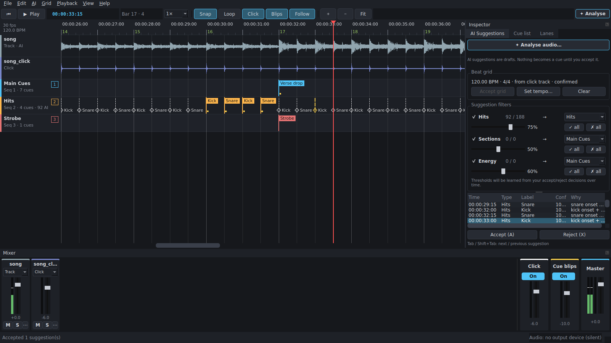
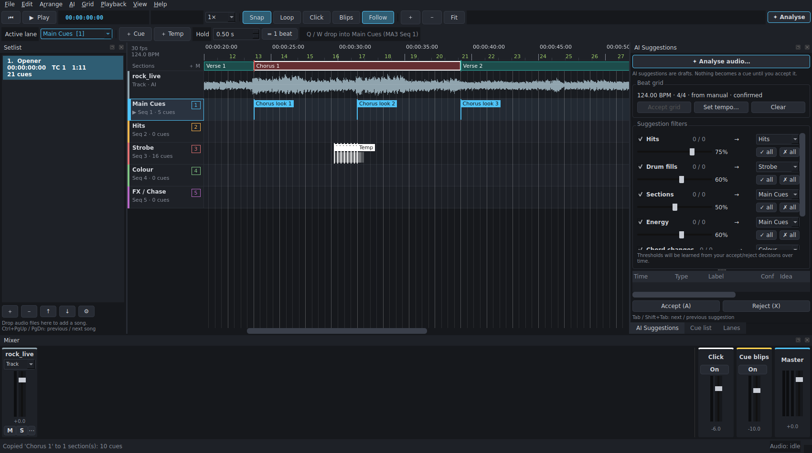
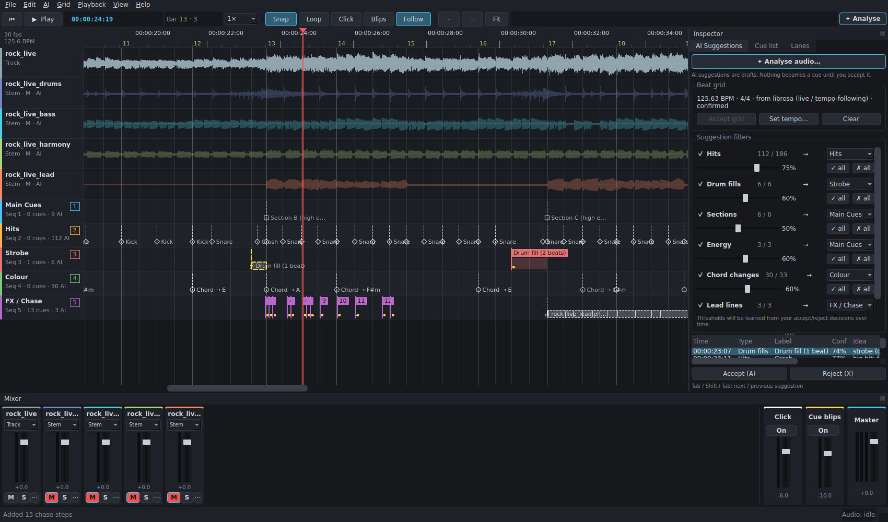

# CueForge User Guide

This guide shows you how to use CueForge to program a show: load songs, mark cues against
the music, review what the AI suggests, and get everything into grandMA3. You don't need
to know anything about how CueForge works inside.

If you only want the shortcut list, press **F1** in the app or jump to
[Keyboard shortcuts](#keyboard-shortcuts).

**Contents**

1. [What CueForge does](#1-what-cueforge-does)
2. [Installing and starting](#2-installing-and-starting)
3. [A tour of the window](#3-a-tour-of-the-window)
4. [Your first song, start to finish](#4-your-first-song-start-to-finish)
5. [Working with audio and the mixer](#5-working-with-audio-and-the-mixer)
6. [The beat grid](#6-the-beat-grid)
7. [Adding and editing cues](#7-adding-and-editing-cues)
8. [AI suggestions](#8-ai-suggestions)
9. [Sections, copy and paste, patterns](#9-sections-copy-and-paste-patterns)
10. [Building a setlist](#10-building-a-setlist)
11. [Exporting to grandMA3](#11-exporting-to-grandma3)
12. [The grandMA3 live link](#12-the-grandma3-live-link)
13. [Programming with MIDI pads or OSC](#13-programming-with-midi-pads-or-osc)
14. [Other imports and exports](#14-other-imports-and-exports)
15. [Saving, autosave and moving projects](#15-saving-autosave-and-moving-projects)
16. [Troubleshooting](#16-troubleshooting)
17. [Keyboard shortcuts](#keyboard-shortcuts)
18. [Glossary](#glossary)

---

## 1. What CueForge does

CueForge is a planning tool for lighting programmers. You load a song, and the song's
audio is laid out on a timeline. You then mark the moments where the lighting should do
something (a hit, a look change, a strobe), and CueForge turns those marks into grandMA3
timecode shows and cue lists.

It can also listen to the song and **suggest** cues for you: drum hits, drum fills,
verse/chorus changes, drops, chord changes and melody lines. Suggestions are drafts. They
never turn into real cues until you accept them, and the AI never moves or deletes a cue
you made.

---

## 2. Installing and starting

### The ready-made app

If you were given a packaged build:

- **Windows:** unzip it and run `CueForge.exe` inside the `CueForge` folder.
- **macOS:** unzip it and move `CueForge.app` to Applications. The app isn't signed by
  Apple, so the first time you open it, **right-click › Open**, then confirm.

### Running from the source folder

You need Python 3.10, 3.11 or 3.12 from [python.org](https://www.python.org/downloads/).

- **Windows:** double-click `run_cueforge.bat`.
- **macOS:** double-click `run_cueforge.command` (the first time: right-click › Open).

The first start sets things up and takes a few minutes. After that it opens straight away.

### The optional AI models

CueForge's built-in analysis works without any downloads. For better beat tracking and the
ability to split a full mix into drums, bass, vocals and other parts, CueForge can install
two extra AI models (about 600 MB, once).

- On first start CueForge asks whether you want them. You can say no and add them later.
- Install or remove them at any time with **AI › AI models (install / remove)…**.
- On Windows with an NVIDIA graphics card, pick the GPU option; it's much faster.

If the models ever fail to load, CueForge quietly uses the built-in analysis instead.

### Choosing the audio output

Use **File › Audio output…** to pick which sound card or interface CueForge plays through.

---

## 3. A tour of the window

| Area | What it's for |
|---|---|
| **Toolbar** (top) | Play, go to start, Snap, Loop, Click, Blips, Follow, zoom, ＋ Cue, ＋ Temp, the **Active lane** box and the **Hold** box. |
| **Ruler** | Timecode and bar numbers. Click to move the playhead; Shift-drag to set a loop. |
| **Section band** | Coloured blocks under the ruler for Verse, Chorus, etc. |
| **Waveforms** | One row per audio file in the song. |
| **Lanes** | One row per cue lane (e.g. Main Cues, Hits, Strobe, Colour). This is where cues live. |
| **Setlist** (left) | The songs in the show. Click one to open it. |
| **AI Suggestions** panel | Run analysis, filter and accept suggestions, manage the beat grid. |
| **Cue list** panel | Every cue as a table you can edit. Follows the playhead during playback. |
| **Lanes** panel | Lane names, colours, tap keys and the grandMA3 sequence each lane goes to. |
| **Mixer** panel | A strip per audio file plus Click, Cue blips and Master. |

Every panel can be dragged anywhere, closed and reopened from **View › Panels**, or
popped out as its own window (**View › Pop out**).

**Two screens?** **View › Dual-monitor layout** (Ctrl+Shift+D) puts all the panels on your
second screen so the timeline gets the whole main screen. Shortcuts work from both
windows. **View › Reset panel layout** puts everything back.

### Lanes

A **lane** is a row of cues that all go to one grandMA3 sequence. A new project starts with
these lanes:

| Lane | Tap key | Typical use |
|---|---|---|
| Main Cues | 1 | Look changes, sections, drops |
| Hits | 2 | Bumps and flashes on kick / snare / crash |
| Strobe | 3 | Strobe bursts (Temps) |
| Colour | 4 | Colour changes |
| FX / Chase | 5 | Chases, movement following a melody |

Rename, recolour, add or remove lanes in the **Lanes** panel. Each lane has:

- **Name** – double-click to rename.
- **Colour** – double-click to change. MIDI pad lights follow this colour too.
- **Tap key** – the key (1–9 by default) that drops a cue into this lane.
- **MA3 seq** – the grandMA3 sequence number this lane exports to.
- **Export** – untick to keep a lane in CueForge only (handy for notes or ideas).

Drag a lane by its **≡** handle in the panel, or by its header on the timeline, to reorder.
Tap keys follow the order: the top lane is key 1.

The **active lane** (marked ▶) is where ＋ Cue and ＋ Temp drop cues. Change it by clicking a
lane, with **↑ / ↓**, or in the toolbar's *Active lane* box.

---

## 4. Your first song, start to finish

This is the quickest path from an audio file to a running timecode show.

1. **Set the frame rate.** **File › Project settings…** › *Frame rate* (24, 25, 29.97 DF,
   29.97 non-drop or 30). Match whatever your show uses. Do this first.
2. **Load the song.** Drag the audio file onto the window, or **File › Import audio into
   this song…** (Ctrl+I). Add stems or a click track too if you have them.
3. **Play it.** Press **Space**. Press **Home** to go back to the start.
4. **Get a beat grid.** Press **Ctrl+R** to open *Analyse audio* and click OK with the
   defaults. When it finishes, check the orange grid lines line up with the beats, then click
   **Accept grid** in the AI Suggestions panel. (See [The beat grid](#6-the-beat-grid) if
   bar 1 is in the wrong place.)
5. **Review suggestions.** Press **Tab** to jump to the first suggestion, **P** to hear it,
   then **A** to accept or **X** to reject. Keep going until you're happy.
6. **Add your own cues.** Play the song and tap **1**, **2**, **3**… to drop cues into those
   lanes as you hear the moments. Hold **3** to make a strobe for as long as you hold it.
7. **Fix timing.** Drag cues, or select one and nudge with **←/→**. Turn on **Snap** (S) to
   keep cues on the beat.
8. **Save.** Ctrl+S.
9. **Export.** **File › Export › grandMA3…** (Ctrl+E), keep *Plugin* selected, and export.
   Then follow [Loading the plugin on the console](#loading-the-plugin-on-the-console).

---

## 5. Working with audio and the mixer

### Adding audio

Drag files onto the window or use **File › Import audio into this song…**. Each file gets a
mixer strip and a **role**. CueForge guesses the role from the file name; change it on the
strip if it guessed wrong.

| Role | Played? | Analysed? | Use for |
|---|---|---|---|
| **Track** | yes | yes | The full song mix |
| **Stem** | yes | yes, on its own | Drums, vocals, bass, keys… (gives much better hits and melody lines) |
| **Click** | yes | builds the beat grid directly | The band's click track |
| **Cue/Guide** | yes | no | Spoken cues, count-ins |
| **Other** | yes | no | Anything else |

If the files don't start at the same moment, use the **⋯** button on the strip to set an
**offset** (*Set offset…*). The same menu has *Relink file…* for a file that has moved.

### The mixer

Each strip has a fader (double-click resets it to 0 dB), a level meter, **M** (mute) and
**S** (solo). There are also three special strips:

- **Click** – a metronome generated from the beat grid, accented on bar 1. Toggle with **C**.
- **Cue blips** – a short tick on every cue, so you can hear whether your cues land on the
  music. Toggle with **B**.
- **Master** – overall volume.

### Moving around

- **Space** plays and pauses. **Home** or **Enter** goes to the start, **End** to the end.
- Click in the ruler to move the playhead.
- **Scrub:** while stopped, drag in the ruler or a waveform to hear the audio under the
  playhead. Turn this off with **View › Scrub audio** (Ctrl+Alt+S).
- **Zoom** with Ctrl + mouse wheel, or **+ / −**. **Z** zooms to fit the whole song.
- **Follow** (F) keeps the playhead in view while playing.
- **Loop:** Shift-drag in the ruler, or press **I** (in) and **O** (out), then **L** to turn
  looping on and off.
- **Slow down:** **[** plays at 0.75× then 0.5×; **]** speeds back up. Good for placing
  fast hits.

---

## 6. The beat grid

The beat grid is the set of beat and bar lines on the timeline. You don't strictly need one,
but with it you get snapping, bar numbers, the click, copy-to-repeats and pattern fill.

### Getting a grid

- **From a click track:** import it with role **Click**. The grid is built from it exactly.
- **From the analysis:** **Ctrl+R**, tick *Beat grid*. A detected grid shows **dashed and
  orange** until you click **Accept grid**.
- **By hand:** **Grid › Set tempo / tap tempo…** (Ctrl+T). Type a BPM or tap it, then set
  where a downbeat is (*Use playhead* helps).

CueForge follows tempo drift in live recordings beat by beat, and detects 3/4 or 4/4 by
itself.

### Fixing a grid

| Problem | Fix |
|---|---|
| Bar 1 is on the wrong beat | Play the song and press **D** on the "one". Or **Ctrl+Alt+← / →** to move bar 1 a beat earlier / later. Or right-click a beat › *Make the nearest beat bar 1*. |
| A count-in or silence before bar 1 has beats | **Grid › Remove beats before bar 1**. |
| The grid is twice as fast as the song | **Grid › Halve tempo**. |
| The grid is half as fast as the song | **Grid › Double tempo**. |
| The whole grid is slightly early / late | **Grid › Shift grid 1 frame earlier / later**. |
| One passage is badly wrong (rubato, a tempo change) | Use the tap-along grid, below. |

After you set bar 1, a **↻ Re-analyse with the new bars** button appears. Click it so that
sections, fills and chord changes line up with your bars. Re-analysis never throws away a
grid you've confirmed.

Bars before bar 1 are numbered 0, −1, … so a count-in still has bar numbers.

### Tap-along grid

1. Turn on **Grid › Tap-along grid**.
2. Play the passage and press **T** on every beat. Taps snap to the real kick and snare
   hits, and any beats you miss are filled in.
3. Turn tap-along mode off. Only the part you tapped is replaced.

---

## 7. Adding and editing cues

There are two kinds of cue:

- A **cue** (also called a Go cue) fires once and stays until the next cue in that lane.
- A **Temp** fires, holds for a set time, then releases. Use Temps for strobes, blinders
  and bumps. On the timeline a Temp has a bar showing how long it holds.

### Ways to add cues

| How | What you get |
|---|---|
| Tap a lane's key (**1**, **2**, **3** …) while playing | A cue in that lane, right where you heard the moment |
| **Hold** a lane's key while playing | A Temp that lasts as long as you hold the key. The bar grows while you hold it. |
| **Q** or *＋ Cue* | A cue in the active lane at the playhead |
| **W** or *＋ Temp* | A Temp in the active lane at the playhead, held for the time in the **Hold** box |
| Double-click in a lane | A cue at that spot |
| MIDI pads or OSC | See [Programming with MIDI pads or OSC](#13-programming-with-midi-pads-or-osc) |

Tips:

- Taps are timed from the moment the key went down and allow for audio latency, so they
  land where you heard them even if the screen is busy.
- You can hold one key and tap another at the same time (e.g. hold 3 for a strobe and tap
  2 for hits).
- A quick tap on a Temp key gets the standard length from the **Hold** box, so short
  strobes come out even. Longer holds keep their own length.
- With **Snap** on, new cues and Temp ends land on the grid. Set the snap resolution
  (1 beat, ½ or ¼ beat) next to *Snap* in the toolbar.

### Selecting

Click a cue, drag a box around several, or Ctrl/Shift-click to add to the selection.
**Ctrl+A** selects all, **Esc** clears.

### Moving and timing

- **Drag** cues to move them, or into another lane. Hold **Alt** to stop snapping.
- **← / →** nudges by one frame; **Shift+← / →** by one beat.
- **G** snaps the selection to the nearest grid point.
- Drag the **end of a Temp's hold bar** to change its length.
- **P** plays from 2 seconds before the selected cue, to check it.

### Editing details

Double-click a cue (or Ctrl+Enter) to open *Edit cue*:

- **Label** – the name that appears on the console.
- **Timecode** – type an exact time.
- **Lane**
- **MA3 cue number** – leave blank for automatic numbering (see below).
- **Fade (s)** – the cue's fade time on the console. Cues with a fade show a ramp after them.
- **Temp hold (s)** – make it a Temp (or clear it to make it a normal cue).
- **Notes** – for yourself.

You can also edit most of these directly in the **Cue list** panel by double-clicking a cell.

### Changing many cues at once

Select the cues and press **H** for *Hold / fade*. You can give them all a hold time
(turning them into Temps), remove the hold (turning them back into cues), and set or clear
their fade. **Shift+W** / **Shift+Q** are quick ways to make the selection Temps / normal cues.

### Cue numbers

You normally don't need to think about cue numbers. Each lane's cues are numbered in time
order, starting from the song's *First cue number*. Automatic numbers are shown dimmed.

- Type a number on a cue to fix it. A cue added between two fixed numbers gets a point
  number such as 5.1.
- **Lanes panel › Numbering ▾** clears fixed numbers, renumbers a lane, or gives the lanes
  sequences 1, 2, 3… in order. A warning shows if two lanes share a sequence.

### Deleting and undoing

**Delete** or **Backspace** removes the selection. **Ctrl+Z** undoes and **Ctrl+Shift+Z** (or
Ctrl+Y) redoes. Undo covers cues, lanes, suggestions, sections and the beat grid (not mixer
moves). If the change was in another song, undo takes you there.

---

## 8. AI suggestions

### Running the analysis

Press **Ctrl+R** (or **✦ Analyse audio…** in the AI Suggestions panel) and choose what to look
for:

| Option | Finds | Suggested as |
|---|---|---|
| Beat grid | Tempo, beats, bar 1 | The dashed orange grid |
| Hits | Kick, snare, crash | Cues in **Hits** (bump / flash / blinder) |
| Drum fills | Fast snare/tom runs into a new bar | Temps in **Strobe**, from the first fast note to the landing |
| Sections | Verse / chorus / bridge changes | Cues in **Main Cues** (new look) |
| Energy | Drops, breakdowns, builds, blackouts | Cues in **Main Cues** |
| Chord changes | Harmony changes, e.g. "Chord → F#m" | Cues in **Colour** |
| Lead lines | Vocal, synth, guitar phrases | **FX / Chase**; can be accepted as one cue per note |

Other options in the dialog:

- **Analyse:** this song, all songs, or only songs not analysed yet.
- **Use deep-learning models when installed** – uses the optional AI models.
- **Separate stems with Demucs** – splits a full mix into parts first. Much better results,
  but slow without a graphics card. The result is saved, so it only happens once per song.

Analysis runs in the background. Keep working, switch songs, or leave it; **AI › Cancel
analysis** stops it. The progress bar shows the time left and gets more accurate the more you
use it.

> **Tip:** for melody lines, import vocal / synth / guitar **stems** (role *Stem*) or tick
> *Demucs*. From a full mix alone, lead lines are only a rough guess and are off by default.

### Reviewing

Suggestions show as dashed, ghosted markers. The more solid one looks, the more confident
CueForge is. Each carries a short reason and an idea for what to program there.

- **Tab / Shift+Tab** – next / previous suggestion.
- **P** – hear it (plays from 2 s before).
- **A** – accept (it becomes a real cue). **X** – reject.
- After A or X, CueForge jumps to the next one. Untick *Jump to the next suggestion after
  Accept / Reject* if you'd rather stay put.
- Right-click a lead line › accept it as chase steps (one cue per note).

In the **AI Suggestions** panel:

- **Show suggestions** – tick or untick each type, and set a **confidence threshold** to
  hide weak ones. Filters only *hide*; use **Reject hidden** to get rid of them for good.
- **→ lane** – change which lane each type goes to.
- **✓ all / ✗ all** – accept or reject every visible suggestion of a type.
- **AI › Accept all visible suggestions in loop region** – accept a whole passage at once.
- **Apply learned thresholds** – CueForge learns from what you accept and reject and offers
  better thresholds. It never applies them without you clicking.

Your decisions are remembered. Re-analysing never brings back something you rejected and
never duplicates a cue.

---

## 9. Sections, copy and paste, patterns

### Sections

The **section band** under the ruler holds the song's structure.

- Press **M** (or *＋ M*) to add a section marker at the playhead. **Shift+M** renames.
- **Arrange › Create sections from AI suggestions** turns the analysis into sections you can
  then fix.
- Drag a section's **edge** to resize it; a shared edge moves both neighbours.
- Drag the **middle** to move it without changing its length.
- Double-click to rename. Give repeats the same name (*Chorus 1*, *Chorus 2*).

### Copying cues to repeats

Program the first chorus, then right-click it › **Copy cues to all repeats** (Ctrl+Shift+C).
The cues are placed by beats from the section start, so they land right even if a live band
drifted, and they're cut off if a repeat is shorter.

### Copy and paste

- **Ctrl+C / Ctrl+X / Ctrl+V** – copy, cut, and paste at the playhead.
- **Ctrl+Shift+V** – paste into the section under the playhead, keeping each cue's position
  within its section.

### Pattern fill

**Arrange › Pattern fill…** (Ctrl+P) adds a cue or Temp at a regular interval (every bar,
2 beats, beat, 8th, triplet or 16th) over the loop region, a section or the selection.

- **Offset** – e.g. shift by half a beat for off-beats.
- **Label** – use `{n}` for a running number, e.g. `Chase {n}`.
- **Replace existing cues** – clear that lane in the range first.

---

## 10. Building a setlist

A project can hold a whole show. The **Setlist** sidebar lists the songs.

- Each song has its own audio, mixer, cues, suggestions, beat grid and start timecode.
- **Lanes are shared** across the whole show, so lane 3 is always Strobe.
- Click a song to open it. **Ctrl+PgUp / Ctrl+PgDn** for previous / next.

### Adding songs

- **＋** in the setlist, **Ctrl+Shift+N**, or drop audio files onto the setlist.
- **File › Add songs from a folder…** – one song per sub-folder. The mix, stems and click
  inside each folder are recognised from their names (sub-folders like `Stems/` too).
- **File › Add songs from files…** – one song per file.

CueForge then offers to analyse them all. You can also use **AI › Analyse all songs in the
setlist…** (Ctrl+Shift+R).

Drag songs in the list to reorder them.

### Song settings

Click **⚙** or double-click a song:

- **Name**
- **Starts at timecode** – where this song sits on the timecode.
- **grandMA3 Timecode slot** – which Timecode pool object it imports into.
- **First cue number** – where its cue numbers start.
- **Sequence offset** – only if each song uses its own block of sequences.
- **Notes**

New songs get sensible defaults automatically: song 2 starts at 02:00:00:00, takes the next
Timecode slot, and gets its own cue range (1, 101, 201…). Right-click › **Auto-number
setlist** resets every song to that scheme.

---

## 11. Exporting to grandMA3

Only **confirmed** cues are exported. Pending suggestions never are.

Open **File › Export › grandMA3…** (Ctrl+E).

| Setting | What it means |
|---|---|
| **Format** | **Plugin** (recommended): one file that does everything. **Timecode XML**: one file per song, you import them yourself. **Command list**: just creates and labels the cues. |
| **Normal cues fire** | **Go+** steps to the next cue (smooth, phasers keep running). **Goto** jumps to the exact cue (safest if you'll be scrubbing timecode). |
| **First cue of each lane is a Goto** | Makes sure each sequence is on the right cue whenever the song starts. Leave on. |
| **Songs** | Current song or the whole setlist. |
| **XML DataVersion** | Set to your console's software version, e.g. 2.1.1.5. |
| **Plugin: create missing cues** | The plugin creates empty, labelled cues in the sequences if they don't exist yet. |

Temps always fire *Temp* at the cue and release when the hold ends.

The dialog warns you about problems before you export, such as two songs writing the same
cue number into the same sequence, cue numbers that don't rise with time when using Go+, or
a lane that mixes Temps with Go+ cues. Keep Temps in their own lane (like Strobe).

### Loading the plugin on the console

1. Export with *Plugin* selected. You get a `.lua` file and an `.xml` file.
2. Copy both to the console's (or onPC's) `gma3_library/datapools/plugins` folder, e.g. on
   a USB stick.
3. On the console, import the plugin into a slot in the **Plugin** pool.
4. Run it once.

The plugin creates and labels the cues, then builds every song's timecode show in its
Timecode slot. It prints what it did in the command-line feedback.

> **Before a show, test the import in grandMA3 onPC.** MA doesn't publish its timecode file
> format, so CueForge follows what grandMA3 itself exports (v1.9–2.x).

---

## 12. The grandMA3 live link

The live link lets CueForge drive a grandMA3 console or onPC directly over the network
while you program. Nothing needs to be installed on the console.

### Console setup (once)

On the console / onPC: **Menu › In & Out › OSC**, add a line:

- **Destination IP:** the CueForge computer (`127.0.0.1` if onPC is on the same computer).
- **Port:** 8000 (or whatever you set in CueForge).
- **Mode:** UDP.
- **Receive** = Yes and **Receive Command** = Yes.
- **Prefix:** leave empty.

Then enable the line and turn on **Enable Input**.

### CueForge setup

Open **File › grandMA3 live link…** (Ctrl+L):

1. Tick **Link to grandMA3**, and enter the console's IP and port.
2. Click **Send test**. The console's command-line feedback should print
   "CueForge link OK".
3. Choose what to send:

| Option | What it does |
|---|---|
| **Live preview** | Fires cues on the console as CueForge plays. When you start or jump, every lane is put on its current cue. Stopping releases running Temps. |
| **Keep cue lists in sync** | Creates and labels cues on the console as you program, about half a second after each edit. Names sequences after their lanes. Sends cue fades too. |
| **Also delete console cues…** | Off by default. Even when on, only deletes cues CueForge created and you deleted in CueForge. |
| **Sync every song** | Otherwise only the open song is synced. |
| **Push timecode shows automatically** | Sends each song's timecode show over the network and imports it into the song's Timecode slot, a few seconds after you stop editing. Works with onPC or a networked console; no files to copy and no folders to set. |
| **Fix cue numbers once they exist on the console** | On by default. Cues already on the console keep their numbers; a new cue between 5 and 6 becomes 5.1. |

Buttons: **Push all cues now** (recreate everything, e.g. for a fresh show file) and **Push
timecode now**. *Last commands sent* shows exactly what went out.

> ⚠ **Keep the programmer clear** while the link creates cues. Cues are created with
> `Store … /Merge`, so anything in the programmer goes into the new cue.

If your MA3 version wants different command wording, tick **Command syntax** in the dialog
and edit the templates. *Defaults* puts them back.

---

## 13. Programming with MIDI pads or OSC

Open **File › MIDI & OSC control…**.

### MIDI pad controllers

Pick your controller under **Input**. Out of the box:

- The bottom row of 8 pads (notes 36–43) drops **cues** into lanes 1–8.
- The next row (notes 44–51) drops **Temps** into lanes 1–8.

This works straight away with a **Midi Fighter Spectra** (bank 1) and with Launchpad /
APC-style controllers, on any MIDI channel.

- **Learn** remaps any pad. You can also map play/stop, next/previous lane, song or
  suggestion, accept/reject, undo, add section and loop.
- **Temp pads** use the Hold time, or (optionally) how long you hold the pad, for live
  strobes.
- **Pad lights:** pads light in their lane's colour, cue pads bright and Temp pads dim, and
  flash white when hit. Leave *Output* empty to use the same device automatically. Change a
  lane's colour to change its pads, or type an LED value (0–127) in the *Pad light* column.
  **Test lights** shows every colour.
- While this window is open, pads never add cues, so learning and testing are safe.

### OSC (TouchOSC, Open Stage Control, Stream Deck…)

CueForge listens on port **8100** by default.

| Address | Does |
|---|---|
| `/cueforge/lane/N/cue` | Cue in lane N |
| `/cueforge/lane/N/temp` | Temp in lane N (press = start, release = end) |
| `/cueforge/cue [lane]`, `/cueforge/temp [lane]` | Same, lane as an argument (or the active lane) |
| `/cueforge/play`, `/stop`, `/loop`, `/undo`, `/section` | Transport and editing |
| `/cueforge/lane/next`, `/lane/prev` | Change active lane |
| `/cueforge/song/next`, `/song/prev` | Change song |
| `/cueforge/suggestion/next`, `/prev`, `/accept`, `/reject` | Review suggestions |

A float argument of 1 / 0 means press / release; an integer is a lane number. CueForge sends
back lane names, colours, the active lane, the song name, and timecode while playing.

---

## 14. Other imports and exports

### Exports (File › Export)

- **CSV cue list** – for paperwork. Can include the whole setlist with a Song column.
- **LTC timecode audio** – a SMPTE timecode WAV for playback systems. Optionally stereo
  with the song on the left and LTC on the right. Add pre-roll so the console locks before
  the song starts.

### Imports (File menu)

- **Import grandMA3 timecode XML…** – bring timecode shows back from the console, e.g. after
  cues were moved on the desk. Each file goes to the song with the same name. Choose
  **Replace** (the console is right) or **Merge**.
- **Import CuePoints CSV / spreadsheet…** – move over from CuePoints or another cue
  spreadsheet. Columns are matched by name and can be reassigned, with a preview. Each
  CuePoints *Track* becomes a song and each *Type* becomes a lane. Set the project frame
  rate first. Importing the same file twice doesn't duplicate cues.

---

## 15. Saving, autosave and moving projects

- Projects are saved as `.cueproj` files (**Ctrl+S**; **File › Save as…** for a copy).
- **File › Open recent** lists your last projects.
- If you have unsaved changes, CueForge autosaves every two minutes to
  `<project>.cueproj.autosave` next to your project.
- Audio file locations are stored relative to the project file. Keep the project and its
  audio in one folder and you can move or copy the folder to another computer.
- If audio goes missing, use **⋯ › Relink file…** on the mixer strip.

---

## 16. Troubleshooting

| Problem | Try |
|---|---|
| No sound | **File › Audio output…** – pick the right device. Check Master, mute and solo. |
| Cues land slightly late or early | Check the beat grid is accepted and Snap is set to the resolution you want. Use **Grid › Shift grid 1 frame** if the whole grid is off. |
| Bar numbers are off by a beat | Press **D** on the "one" while playing, or **Ctrl+Alt+← / →**. Then *Re-analyse with the new bars*. |
| Grid is double / half speed | **Grid › Halve tempo** / **Double tempo**. |
| Too many weak suggestions | Raise the type's confidence threshold, then **Reject hidden**. |
| Few or no melody / lead suggestions | Import stems or tick Demucs. From a full mix, lead lines are off by default. |
| Analysis is very slow | Untick Demucs, or install the GPU build of the AI models (Windows + NVIDIA). |
| Export warns about cue number clashes | Give songs different first cue numbers (setlist › right-click › *Auto-number setlist*). |
| Export warns about Go+ | Keep Temps in their own lane, or switch *Normal cues fire* to Goto. |
| Two lanes use the same sequence | **Lanes panel › Numbering ▾ › Number MA3 sequences 1, 2, 3…** |
| Live link: nothing happens on the console | Click *Send test*. On the console check *Receive Command* = Yes, the line and *Enable Input* are on, and the Prefix is empty (CueForge sends to `/cmd`). The System Monitor shows every OSC message received. |
| Live link: cues come out with unexpected values | Clear the programmer before syncing. |
| Timecode import fails on the console | Use the Plugin export; set *XML DataVersion* to your software version; test on onPC first. |
| macOS won't open the app | Right-click › Open the first time. |

---

## Keyboard shortcuts

Press **F1** in the app for this list.

**Playback**

| Key | Action |
|---|---|
| Space | Play / pause |
| Home / Enter | Go to start |
| End | Go to end |
| P | Preview: play from 2 s before the selection |
| I / O / L | Loop in / loop out / loop on-off |
| [ / ] | Slower / faster |
| C / B | Click / cue blips on-off |
| F | Follow playhead |
| Z | Zoom to fit |
| Ctrl + wheel, + / − | Zoom |
| Ctrl+Alt+S | Scrub audio on-off |

**Cues**

| Key | Action |
|---|---|
| 1 … 9 | Tap a cue into that lane |
| Hold 1 … 9 | Drop a Temp for as long as the key is held |
| Q / W | ＋ Cue / ＋ Temp in the active lane |
| ↑ / ↓ | Previous / next active lane |
| ← / → | Nudge selection 1 frame (nothing selected: move playhead 1 beat) |
| Shift + ← / → | Nudge selection 1 beat (nothing selected: move playhead 1 bar) |
| S | Snap on-off |
| G | Snap selection to grid |
| H | Hold / fade for selected cues |
| Shift+W / Shift+Q | Make selection Temps / normal cues |
| Ctrl+Enter | Edit selected cue |
| Delete / Backspace | Delete selection |
| Ctrl+A / Esc | Select all / clear selection |
| Ctrl+Z / Ctrl+Shift+Z | Undo / redo |

**AI and grid**

| Key | Action |
|---|---|
| Ctrl+R | Analyse audio |
| Ctrl+Shift+R | Analyse all songs |
| Tab / Shift+Tab | Next / previous suggestion |
| A / X | Accept / reject |
| Ctrl+T | Set tempo / tap tempo |
| D | Set bar 1 at the playhead |
| Ctrl+Alt+← / → | Move bar 1 a beat earlier / later |
| T | Tap a grid beat (tap-along mode) |

**Arranging**

| Key | Action |
|---|---|
| M / Shift+M | Add / rename section |
| Ctrl+C / X / V | Copy / cut / paste at playhead |
| Ctrl+Shift+V | Paste into section (aligned) |
| Ctrl+Shift+C | Copy section cues to all repeats |
| Ctrl+P | Pattern fill |

**Project and windows**

| Key | Action |
|---|---|
| Ctrl+N / Ctrl+O / Ctrl+S | New / open / save |
| Ctrl+I | Import audio into this song |
| Ctrl+Shift+N | Add a song |
| Ctrl+PgUp / Ctrl+PgDn | Previous / next song |
| Ctrl+E | Export to grandMA3 |
| Ctrl+L | grandMA3 live link |
| Ctrl+Shift+D | Dual-monitor layout |
| F1 | Keyboard shortcuts |

(On macOS, Ctrl is ⌘ for the standard shortcuts like save, copy and undo.)

---

## Glossary

- **Active lane** – the lane ＋ Cue (Q) and ＋ Temp (W) drop into. Marked with ▶.
- **Beat grid** – the beat and bar lines CueForge snaps to.
- **Cue** – a moment where the lighting changes. Fires once and stays.
- **Go+ / Goto** – how grandMA3 is told to fire a cue: step to the next one, or jump to a
  specific one.
- **Lane** – a row of cues on the timeline; exports to one grandMA3 sequence.
- **LTC** – timecode sent as audio, for locking a console to playback.
- **Section** – a named part of the song (Verse, Chorus…) shown in the section band.
- **Setlist** – the list of songs in a project.
- **Snap** – makes cues land exactly on the beat grid.
- **Stem** – a separate audio file for one part of the song (drums, vocals…).
- **Suggestion** – a cue the AI proposes. Ghosted until you accept it.
- **Temp** – a cue with a hold time: it fires, holds, then releases. Used for strobes and bumps.
- **Timecode slot** – the grandMA3 Timecode pool object a song is imported into.
